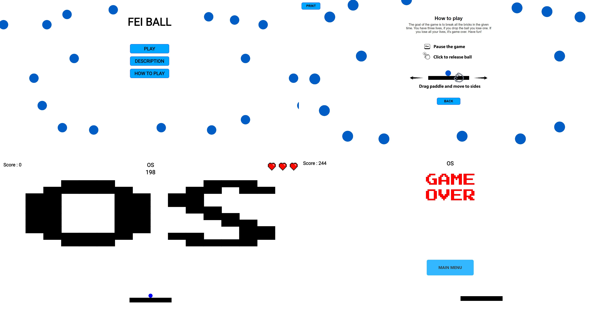

<p align="center"></p>
<h1 align="center">⚾ FEI BALL</h1>


Drag and drop JavaScript game inspired by DX-Ball.

## 📀 Installation

No installation is needed for this game. Just clone the repository or download the source code and start playing in your favorite web browser.
If you have any problems playing the game, try to start the game using the extension live server.

```bash
git clone https://github.com/MatKollar/FEI-BALL.git
```
## 📝 Description
This game was inspired by DX-Ball. It is a brick-breaking game where the player controls a paddle at the bottom of the screen and bounces a ball off of it to break bricks at the top of the screen. The game has different levels according to FEI subjects with increasing difficulty. The game is created using HTML, CSS, and JavaScript and can be played through a web browser.

## 🕹️ Game Instructions

- The game is controlled with the mouse. 🖱️
- For moving with a paddle drag it and move to the sides. ↔️ 
- The goal of the game is to break all the bricks in the given time. ⏲️ 
- You have three lives, if you drop the ball you lose one. ❤️
- If you lose all your lives, it's game over. 😢
- Have fun! 🎉

## 🖥️ Usage

You can create or edit your own custom levels in the ```stage_data.json``` file.

## 📸 Screenshots

